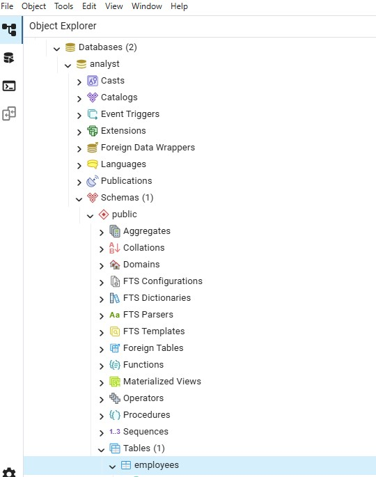

# PostgreSQL & Power BI Learning Infrastructure for Beginner Data Analytics

A PostgreSQL-based SQL training environment created for the WYCF( Winners Corpers Fellowship, Kano) Skill Acquisition Program to support beginner learners practicing SQL remotely using controlled database access.

---

##  Project Overview

This project was created as part of a volunteer SQL training initiative designed to provide students with a hands-on SQL learning environment using PostgreSQL. Students connect remotely to a centralized database server through Tailscale and practice SQL queries using shared datasets.

The setup supports both desktop and mobile users through pgAdmin 4 and PG Orbit.
This project provides a lightweight PostgreSQL-based learning infrastructure for teaching SQL and Power BI data analytics workflows to beginner learners under low-resource conditions.

The environment was designed for learners using mobile devices and older 32-bit computers, enabling accessible SQL practice, remote database connectivity, and Power BI visualization workflows.

---

##  Objectives

- Teach beginner SQL and data analysis concepts
- Simulate a real client-server database workflow
- Provide secure multi-user database access
- Support remote learning for mobile and desktop users
- Introduce students to practical SQL querying

---

## Evolution of the Learning Infrastructure

The training environment evolved over multiple stages to accommodate varying learner capabilities, internet access, and hardware limitations.

### Phase 1: Lightweight Onboarding Workflow

During the early stages of the program, most learners were provided with PostgreSQL backup files containing sample employees datasets.
- PC users restored the backup directly into PostgreSQL using pgAdmin 4.
- Some mobile users imported simplified datasets through Sqliteonline for introductory SQL practice.

This approach reduced dependency on constant internet access and lowered the barrier to entry for beginners using low-spec devices.
However, as the training advanced into more realistic analytics scenarios using the Wide World Importers (WWI) dataset, the Sqliteonline workflow became less viable due to:
- limited support for complex relational structures,
- scalability constraints,
- dependency on paid features,
- and challenges handling multiple dimension tables linked to fact tables.

Examples of advanced analytical tables used later in the program include:

- DimDate
- DimEmployee
- FactSales and other star-schema style relationships.

---

### Phase 2: PostgreSQL-Centered Analytics Workflow

The infrastructure later transitioned fully into a PostgreSQL-based workflow designed for more advanced SQL analytics and Power BI integration.

Current workflow:


Learners now:
- perform SQL analysis directly within PostgreSQL tools,
- write analytical queries against relational datasets,
- and reuse those queries directly inside Power BI for visualization and reporting.

This transition improved:

scalability,
relational data modeling support,
analytics capabilities,
and real-world BI workflow alignment.


---

##  Technologies Used

- PostgreSQL
- pgAdmin 4
- PG Orbit
- Tailscale
- Dbeaver
- Sqliteonline

---

##  Database Access Configuration

The environment uses role-based access control to manage student access.

Implemented:
- Restricted user roles
- Controlled table permissions
- Connection limits
- Read-only access for students

Example:

```sql
CREATE ROLE my_user WITH LOGIN PASSWORD 'your_password';

GRANT data_analyst TO my_user;

GRANT SELECT ON ALL TABLES IN SCHEMA public TO data_analyst;
```
---

## Dataset

The training environment includes an Employees dataset, Microsoft's Wide World Importers (WWI) dataset used for:

- SELECT statements
- Filtering
- Aggregations
- GROUP BY analysis
- Data exploration
- Data cleaning
- Data Visualization

---

## Remote Learning Architecture


---

## Topics Covered

- Basic Data Analysis
- Relational Database Concepts
- SQL Fundamentals
- Filtering & Sorting
- Aggregation Functions
- GROUP BY
- Data Cleaning

---

## Screenshots

### Database Role creation


### Table creation


### WWI dataset ERD diagram


### Analyst database setup


- Student database connection
- SQL query execution

---

## Lessons Learned

Through this project, I gained practical experience in:
- PostgreSQL user management
- Role-based access control
- Multi-user database environments
- Remote database connectivity
- Structuring datasets for SQL education
- Supporting beginner learners with real database systems.

---

## Setup Instructions

1. Install PostgreSQL
2. Run the SQL files inside the setup folder
3. Execute the dataset creation scripts
4. Connect using pgAdmin 4, Dbeaver or PG Orbit

---

## Project Timeline

Started: 10 May 2026

Status: Active

---

## Author

### Isaac Uko Inyang

Associate Data Engineer with proficiency in SQL, data cleaning, and database systems.

- LinkedIn: https://www.linkedin.com/in/isaacukoinyang
- GitHub: https://github.com/Isaac-Inyang
