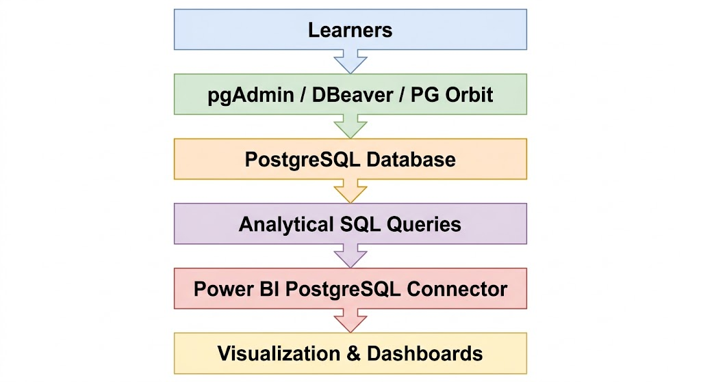
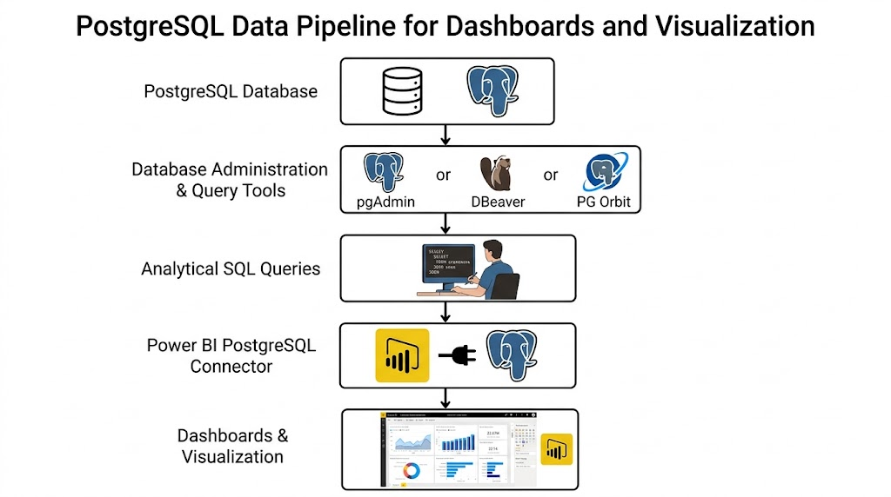
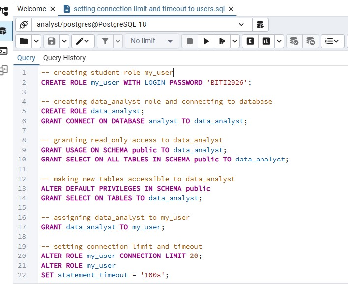
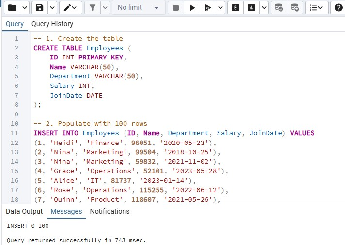
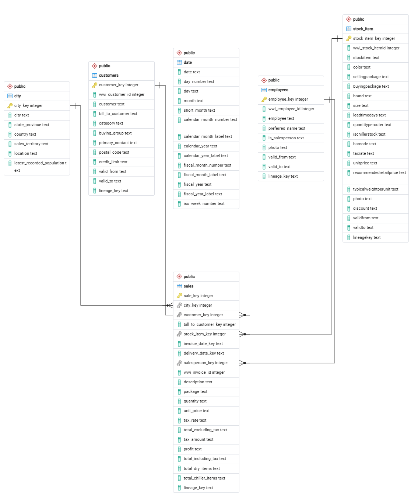

# PostgreSQL & Power BI Learning Infrastructure for Beginner Data Analytics

A PostgreSQL-based SQL training environment created for the WYCF( Winners Corpers Fellowship, Kano) Skill Acquisition Program to support beginner learners practicing SQL remotely using controlled database access.

---

##  Project Overview

This project provides a lightweight PostgreSQL-based learning infrastructure for teaching SQL and Power BI data analytics workflows to beginner learners under low-resource conditions.
The environment was designed for learners using mobile devices and older 32-bit computers, enabling accessible SQL practice, remote database connectivity, and Power BI visualization workflows.

---

## Project Metrics

1. Training started: May 10, 2026
2. Beginner learners supported: 20+
3. Training format: Remote & physical sessions
4. Database systems used: PostgreSQL
5. SQL tools supported: pgAdmin 4, DBeaver, PG Orbit
6. Visualization platform: Power BI
7. Learning datasets used: Wide World Importers (WWI) and generated employees datasets
8. Supported environments:
  - PostgreSQL local restore
  - Remote PostgreSQL access via Tailscale
9. Device support:
  - Mobile users (Android and Iphone)
  - Low-spec PCs
  - 32-bit systems

---

## Problem Statement

Many learners had:
- mobile phones instead of laptops,
- low-spec or 32-bit computers,
- limited technical experience,
- and unreliable access to modern software tools.

The challenge was to create a lightweight, beginner-friendly analytics environment that could run under these constraints while still providing real-world SQL and BI workflows.

---

## Solution Architecture



---

## Workflow Evolution & Architectural Decisions

The training environment evolved over multiple stages to accommodate varying learner capabilities, internet access, and hardware limitations.

### Phase 1: Lightweight Onboarding Workflow

During the early stages of the program, most learners were provided with PostgreSQL backup files containing sample employees datasets.
- PC users restored the backup directly into PostgreSQL using pgAdmin 4.
- Some mobile users imported simplified datasets through Sqliteonline for introductory SQL practice.

This approach reduced dependency on constant internet access and lowered the barrier to entry for beginners using low-spec devices.
However, as the training advanced into more realistic analytics scenarios using the Wide World Importers (WWI) dataset, the Sqliteonline workflow became less viable due to:
- limited support for complex relational structures,
- scalability constraints,
- dependency on paid features,
- and challenges handling multiple dimension tables linked to fact tables.

Examples of advanced analytical tables used later in the program include:

- DimDate
- DimEmployee
- FactSales and other star-schema style relationships.

---

### Phase 2: PostgreSQL-Centered Analytics Workflow

The infrastructure later transitioned fully into a PostgreSQL-based workflow designed for more advanced SQL analytics and Power BI integration.

Current workflow:



Learners now:
- perform SQL analysis directly within PostgreSQL tools,
- write analytical queries against relational datasets,
- and reuse those queries directly inside Power BI for visualization and reporting.

This transition improved:

- scalability,
- relational data modeling support,
- analytics capabilities,
- and real-world BI workflow alignment.


---

## Features

- PostgreSQL-based SQL learning environment
- Remote database access using Tailscale
- Beginner-friendly SQL workflows
- Power BI integration using direct SQL queries
- Support for older 32-bit systems
- Mobile-accessible learning support
- Structured SQL practice datasets
- Technical onboarding documentation

---

## Tech Stack

- PostgreSQL
- Power BI
- pgAdmin 4
- DBeaver
- PG Orbit
- Tailscale
- SQL
---

## Power BI Workflow

Learners write and test analytical SQL queries using pgAdmin, DBeaver, or PG Orbit.
The SQL queries are then pasted directly into Power BI through the PostgreSQL connector using the  SQL statement text box.
This enables direct querying and visualization without creating temporary analytical tables.

---

##  Database Access Configuration

The environment uses role-based access control to manage student access.

Implemented:
- Restricted user roles
- Controlled table permissions
- Connection limits
- Read-only access for students

Example:

```sql
CREATE ROLE my_user WITH LOGIN PASSWORD 'your_password';

GRANT data_analyst TO my_user;

GRANT SELECT ON ALL TABLES IN SCHEMA public TO data_analyst;
```
---

## Dataset

The training environment includes an Employees dataset, Microsoft's Wide World Importers (WWI) dataset used for:

- SELECT statements
- Filtering
- Aggregations
- GROUP BY analysis
- Data exploration
- Data cleaning
- Data Visualization

---

## Remote Learning Architecture


---

## Topics Covered

- Basic Data Analysis
- Relational Database Concepts
- SQL Fundamentals
- Filtering & Sorting
- Aggregation Functions
- Data Manipulation
- Data Cleaning
- Data Visualization

---

## Screenshots

### Database Role creation


### Table creation


### WWI dataset ERD diagram


### Remote PostgreSQL Connection


### Power BI connection

### Power BI Dashboard

### SQL query execution

---

## Engineering Challenges Solved

- Supported learners with low-spec 32-bit computers
- Reduced onboarding complexity for beginners
- Enabled SQL learning through remote connectivity
- Designed lightweight workflows for mobile-first learners
- Simplified Power BI integration through direct SQL execution

---

## Lessons Learned

This project improved my understanding of:
- PostgreSQL user management
- Role-based access control
- SQL workflow design
- Remote database connectivity
- Power BI connectivity
- Technical documentation
- Accessibility-focused infrastructure design
- Beginner onboarding strategies


---

## Setup Instructions

1. Install PostgreSQL
2. Install pgAdmin or DBeaver
3. Connect using Tailscale or Restore sample database
5. Run SQL queries
6. Connect Power BI to PostgreSQL

---

## Future Improvements

- Add ETL workflow demonstrations
- Introduce query optimization lessons
- Expand analytics datasets
- Assign analytical project to learners.

---

## Project Timeline

Started: 10 May 2026

Status: Active

---

## Author

### Isaac Uko Inyang

Associate Data Engineer with proficiency in SQL, data cleaning, and database systems.

- LinkedIn: https://www.linkedin.com/in/isaacukoinyang
- GitHub: https://github.com/Isaac-Inyang
